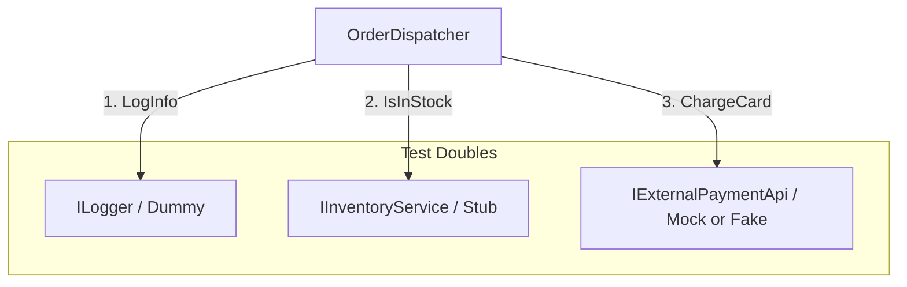

# Test Plan: Component Isolation & Test Doubles

## Architecture Overview
The following diagram illustrates how the `OrderDispatcher` (SUT) interacts with its dependencies and how we isolate them for testing.

## Test Case Overview

| Scenario | Primary Double Used | Goal | Expected Outcome |
| :--- | :--- | :--- | :--- |
| **Out of Stock** | `Stub` | Verify branch logic when inventory check fails. | Returns `false` |
| **Successful Call** | `Mock` | Verify the SUT actually calls the Payment API (Behavior). | `Verify` passes |
| **API Outage** | `Fake` | Verify the SUT handles a `false` return from the API (State). | **Currently Fails** (Exposes Bug) |
| **Happy Path** | `Fake` | Verify the charge is correctly recorded in the ledger state. | Returns `true` + State valid |

## Educational Focus: Why The Fake?
While the `Mock` test passes by confirming the API was *called*, the `Fake` test fails because it checks the *result*. This highlights the risk of "Interaction Testing" where the developer might call a method but forget to check its return value—an extremely common production bug.
